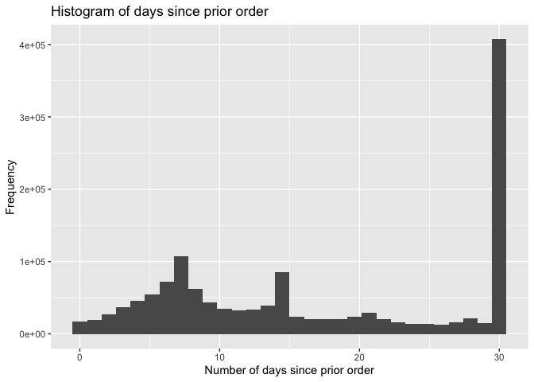
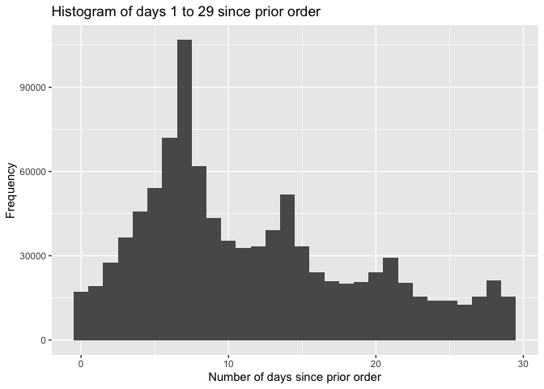
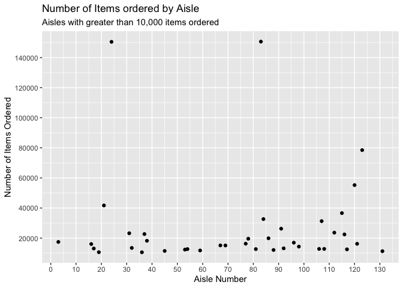
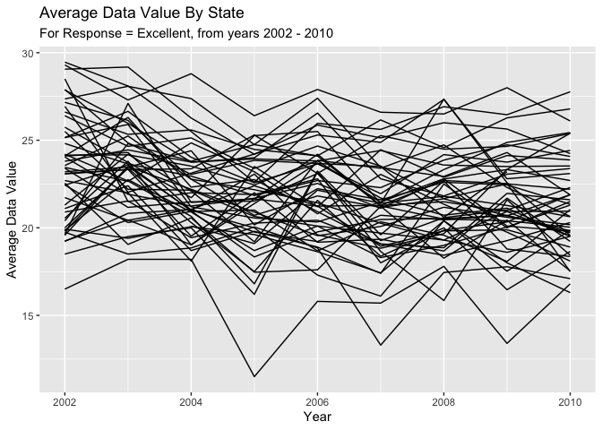
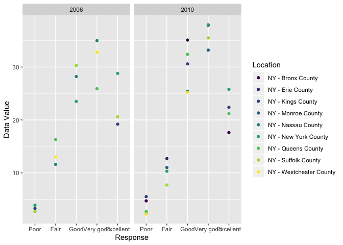
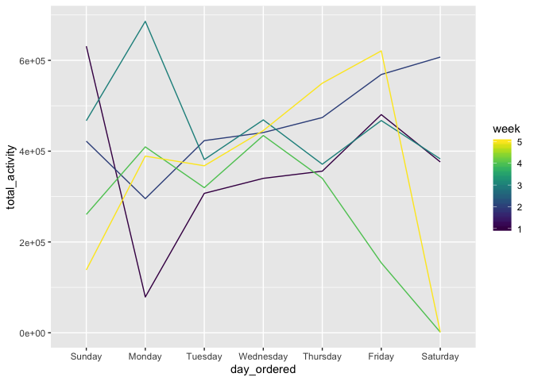
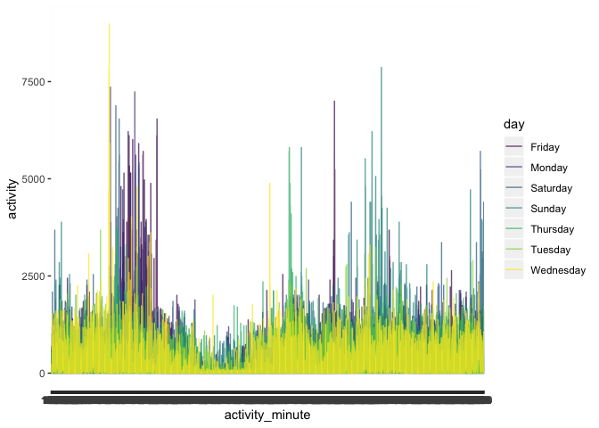
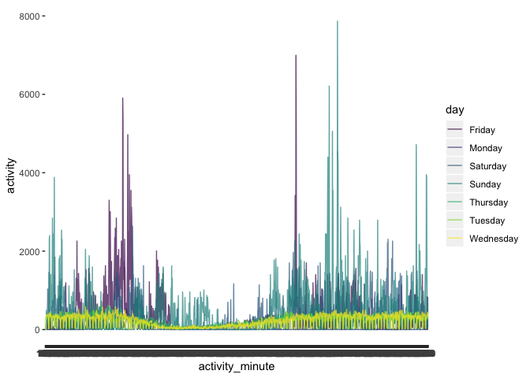

homework 3
================
lauren franks, lef2147
10/3/2019

Problem 1 Loading Data

``` r
library(p8105.datasets)
data("instacart") 
```

To that end, write a short description of the dataset, noting the size
and structure of the data, describing some key variables, and giving
illstrative examples of observations

``` r
ggplot(instacart, aes(days_since_prior_order)) + 
  geom_histogram() + 
  labs(title = "Histogram of days since prior order",
       x = "Number of days since prior order",
       y = "Frequency")
```

    ## `stat_bin()` using `bins = 30`. Pick better value with `binwidth`.

<!-- -->

``` r
instacart %>% filter(days_since_prior_order < 30) %>% 
  ggplot(aes(days_since_prior_order)) +
  geom_histogram() + 
  labs(title = "Histogram of days 1 to 29 since prior order",
       x = "Number of days since prior order",
       y = "Frequency")
```

    ## `stat_bin()` using `bins = 30`. Pick better value with `binwidth`.

<!-- -->

``` r
instacart %>% count(days_since_prior_order == 30)
```

    ## # A tibble: 2 x 2
    ##   `days_since_prior_order == 30`      n
    ##   <lgl>                           <int>
    ## 1 FALSE                          977352
    ## 2 TRUE                           407265

``` r
total_prod_ordered = instacart %>% group_by(order_id) %>% 
  summarise(
    total_products_ordered = n()
  )
```

There are 15 variables in the instacart dataset, and 1384617
observations. There are 4 character variables, and 11 integer variables.
The mean number of items per order is 10.5527593. Investigating the
variable days\_since\_prior\_order, based on the histogram we can see
that it is right skewed, with a high proportion of values at 30 days.
Removing the observations that = “30”, we can see that there are several
peaks across the variable. The peaks are at 7, 14, 21 and 28 days, with
the highest peak at 7 days. This may suggest that people generally
reorder from instacart on the same day of the week that they made their
previous order. The high proportion of observations categorized as 30
suggests that anyone who orders past 30 days gets grouped into “30” in
this dataset.

How many aisles are there, and which aisles are the most items ordered
from?

``` r
instacart %>% group_by(aisle_id) %>% 
  summarise(n_obs = n(), n_unique = n_distinct(aisle_id)) %>% 
  arrange(desc(n_obs))
```

    ## # A tibble: 134 x 3
    ##    aisle_id  n_obs n_unique
    ##       <int>  <int>    <int>
    ##  1       83 150609        1
    ##  2       24 150473        1
    ##  3      123  78493        1
    ##  4      120  55240        1
    ##  5       21  41699        1
    ##  6      115  36617        1
    ##  7       84  32644        1
    ##  8      107  31269        1
    ##  9       91  26240        1
    ## 10      112  23635        1
    ## # … with 124 more rows

Aisle 83 has the most orders, and there are 134 aisles in total.

Make a plot that shows the number of items ordered in each aisle,
limiting this to aisles with more than 10,000 items ordered. Arrange
aisles sensibly, and organize your plot so others can read it.

``` r
instacart %>% group_by(aisle_id) %>% 
  tally() %>% 
  subset(n > 10000) %>% 
  ggplot(aes(aisle_id, n, label = aisle_id)) + 
  geom_point() + labs(
    title = "Number of Items ordered by Aisle",
    subtitle = "Aisles with greater than 10,000 items ordered",
    x = "Aisle Number",
    y = "Number of Items Ordered"
  ) + scale_x_continuous(
    breaks = c(0, 10, 20, 30, 40, 50, 60, 70, 80, 90, 100, 110, 120, 130, 140)
  ) + scale_y_continuous(
    breaks = c(20000, 40000, 60000, 80000, 100000, 120000, 140000)
  )
```

<!-- -->

Make a table showing the three most popular items in each of the aisles
“baking ingredients”, “dog food care”, and “packaged vegetables
fruits”. Include the number of times each item is ordered in your
table.

``` r
instacart %>% 
  filter(aisle == c("baking ingredients", "dog food care", "packaged vegetables fruits")) %>% 
  group_by(aisle, product_name) %>% 
  summarise(n_obs = n()) %>% 
  arrange(desc(n_obs)) %>% 
  group_by(aisle) %>% 
  top_n(3) %>% 
  as.tibble() %>% formattable::formattable(col.names = c("Aisle", "Product Name", "Number of items ordered"))
```

    ## Selecting by n_obs

    ## Warning: `as.tibble()` is deprecated, use `as_tibble()` (but mind the new semantics).
    ## This warning is displayed once per session.

<table class="table table-condensed">

<thead>

<tr>

<th style="text-align:right;">

Aisle

</th>

<th style="text-align:right;">

Product Name

</th>

<th style="text-align:right;">

Number of items ordered

</th>

</tr>

</thead>

<tbody>

<tr>

<td style="text-align:right;">

packaged vegetables fruits

</td>

<td style="text-align:right;">

Organic Baby Spinach

</td>

<td style="text-align:right;">

3324

</td>

</tr>

<tr>

<td style="text-align:right;">

packaged vegetables fruits

</td>

<td style="text-align:right;">

Organic Raspberries

</td>

<td style="text-align:right;">

1920

</td>

</tr>

<tr>

<td style="text-align:right;">

packaged vegetables fruits

</td>

<td style="text-align:right;">

Organic Blueberries

</td>

<td style="text-align:right;">

1692

</td>

</tr>

<tr>

<td style="text-align:right;">

baking ingredients

</td>

<td style="text-align:right;">

Light Brown Sugar

</td>

<td style="text-align:right;">

157

</td>

</tr>

<tr>

<td style="text-align:right;">

baking ingredients

</td>

<td style="text-align:right;">

Pure Baking Soda

</td>

<td style="text-align:right;">

140

</td>

</tr>

<tr>

<td style="text-align:right;">

baking ingredients

</td>

<td style="text-align:right;">

Organic Vanilla Extract

</td>

<td style="text-align:right;">

122

</td>

</tr>

<tr>

<td style="text-align:right;">

dog food care

</td>

<td style="text-align:right;">

Organix Grain Free Chicken & Vegetable Dog Food

</td>

<td style="text-align:right;">

14

</td>

</tr>

<tr>

<td style="text-align:right;">

dog food care

</td>

<td style="text-align:right;">

Organix Chicken & Brown Rice Recipe

</td>

<td style="text-align:right;">

13

</td>

</tr>

<tr>

<td style="text-align:right;">

dog food care

</td>

<td style="text-align:right;">

Original Dry Dog

</td>

<td style="text-align:right;">

9

</td>

</tr>

</tbody>

</table>

Make a table showing the mean hour of the day at which Pink Lady Apples
and Coffee Ice Cream are ordered on each day of the week; format this
table for human readers (i.e. produce a 2 x 7 table)

``` r
instacart %>% select(order_dow, order_hour_of_day, product_name) %>% 
  filter(product_name == c("Pink Lady Apples", "Coffee Ice Cream")) %>% 
  group_by(order_dow, order_hour_of_day, product_name) %>% 
  summarise(n_obs = n()) %>% 
  group_by(product_name, order_dow) %>% 
  filter(n_obs == max(n_obs)) %>% 
  summarise(mean_hour = mean(n_obs)) %>% 
  tidyr::pivot_wider(
    names_from = order_dow,
    values_from = mean_hour
  ) %>% knitr::kable(col.names = c("Product Name", "Sun", "Mon", "Tues", "Wed", "Thurs", "Fri", "Sat"))
```

    ## Warning in product_name == c("Pink Lady Apples", "Coffee Ice Cream"):
    ## longer object length is not a multiple of shorter object length

| Product Name     | Sun | Mon | Tues | Wed | Thurs | Fri | Sat |
| :--------------- | --: | --: | ---: | --: | ----: | --: | --: |
| Coffee Ice Cream |   3 |   4 |    3 |   3 |     3 |   1 |   4 |
| Pink Lady Apples |   3 |   7 |    4 |   2 |     2 |   4 |   2 |

Question 2 Loading Data

Data Cleaning - format the data to use appropriate variable names -
focus on the “Overall Health” topic - include only responses from
“Excellent” to “Poor” - organize responses as a factor taking levels
ordered from “Poor” to “Excellent”

``` r
brfss = janitor::clean_names(brfss_smart2010) %>% 
  rename(
    state_abb = locationabbr,
    county = locationdesc
  ) %>% 
  filter(topic == "Overall Health") %>% 
  mutate(
    response = as.factor(response),
    response = factor(response, levels = c("Poor", "Fair", "Good", "Very good", "Excellent"), ordered = TRUE)
    ) %>% 
  arrange(response) %>% select(-c(class, topic, question))
```

Questions: In 2002, which states were observed at 7 or more locations?
What about in 2010?

``` r
brfss %>% filter(year == 2002) %>% 
  group_by(county, state_abb) %>% 
  summarise(n_obs = 1) %>% 
  group_by(state_abb) %>% 
  summarise(sum_loc = sum(n_obs)) %>% 
  subset(sum_loc >= 7)
```

    ## # A tibble: 6 x 2
    ##   state_abb sum_loc
    ##   <chr>       <dbl>
    ## 1 CT              7
    ## 2 FL              7
    ## 3 MA              8
    ## 4 NC              7
    ## 5 NJ              8
    ## 6 PA             10

``` r
brfss %>% filter(year == 2010) %>% 
  group_by(county, state_abb) %>% 
  summarise(n_obs = 1) %>% 
  group_by(state_abb) %>% 
  summarise(sum_loc = sum(n_obs)) %>% 
  subset(sum_loc >= 7)
```

    ## # A tibble: 14 x 2
    ##    state_abb sum_loc
    ##    <chr>       <dbl>
    ##  1 CA             12
    ##  2 CO              7
    ##  3 FL             41
    ##  4 MA              9
    ##  5 MD             12
    ##  6 NC             12
    ##  7 NE             10
    ##  8 NJ             19
    ##  9 NY              9
    ## 10 OH              8
    ## 11 PA              7
    ## 12 SC              7
    ## 13 TX             16
    ## 14 WA             10

In 2002, there were 6 states observed at 7 or more locations (CT, FL,
MA, NC, NJ, and PA), and in 2010 there were 14 states (CA, CO, FL, MA,
MD, NC, NE, NJ, NY, OH, PA, SC, TX and WA).

Construct a dataset that is limited to Excellent responses, and contains
year, state, and a variable that averages the data\_value across
locations within a state. Make a “spaghetti” plot of this average value
over time within a state (that is, make a plot showing a line for each
state across years – the geom\_line geometry and group aesthetic will
help).

``` r
brfss_exc = brfss %>% filter(response == "Excellent") %>% 
  select(year, state_abb, county, data_value) %>% 
  group_by(state_abb, year) %>% 
  summarise(
    avg_data_value = mean(data_value, na.rm = TRUE)
  )

brfss_exc %>% ggplot(aes(year, avg_data_value, group = state_abb)) + 
  geom_line() +
  labs(
    title = "Average Data Value By State",
    subtitle = "For Response = Excellent, from years 2002 - 2010",
    x = "Year",
    y = "Average Data Value"
  ) 
```

<!-- -->
This plot shows the trend of the average data value across all counties
per state from 2002 to 2010. Because of the density of datapoints in
this plot, it is difficult to take away information from it. Labels make
it too jumbled to read. You can see there is a slight, general downward
trend; in 2002 there were several states with average data values close
to 30, whereas in 2010 most states were below 27.5.

Make a two-panel plot showing, for the years 2006, and 2010,
distribution of data\_value for responses (“Poor” to “Excellent”) among
locations in NY State.

``` r
brfss %>% filter(year == c(2006, 2010), state_abb == "NY") %>% 
  group_by(county, response) %>% 
  select(year, county, response, data_value) %>% 
  ggplot(aes(response, data_value, group = county, color = county)) + 
  geom_point() +
  facet_grid(~year) +
  labs(
    x = "Response",
    y = "Data Value"
  ) + 
  viridis::scale_color_viridis(
    name = "Location",
    discrete = TRUE
  )
```

    ## Warning in year == c(2006, 2010): longer object length is not a multiple of
    ## shorter object length

<!-- -->
In both 2006 and 2010, “good” and “very good” responses had on average
higher data values than “excellent” responses. There is a smaller spread
in response “very good” in 2010 compared to “very good” in 2006, and
poor responses have a greater spread in 2010 compared to poor reponses
in 2006. Both graphs show the same overall trend with a general increase
from Poor – Very Good and a slight decrease for excellent responses.
Counties who were interview in 2006 were not neccessarily interviewed in
2010, which could introduce some data discrepancies when comparing the
data vales between the two years.

Question 3: Loading Data Load, tidy, and otherwise wrangle the data.
Your final dataset should include all originally observed variables and
values; have useful variable names; include a weekday vs weekend
variable; and encode data with reasonable variable classes. Describe the
resulting dataset (e.g. what variables exist, how many observations,
etc).

``` r
accel_data = read_csv("./accel_data.csv")
```

    ## Parsed with column specification:
    ## cols(
    ##   .default = col_double(),
    ##   day = col_character()
    ## )

    ## See spec(...) for full column specifications.

Tidying Data

``` r
accel_data = accel_data %>% janitor::clean_names() %>% 
  mutate(
    weekend = ifelse(day == c("Saturday", "Sunday"), "Weekend", "Weekday"),
    day_ordered = factor(day, levels = c("Sunday", "Monday", "Tuesday", "Wednesday", "Thursday", "Friday", "Saturday"), ordered = TRUE)
  ) %>% 
  select(week, day_id, day, day_ordered, weekend, activity_1:activity_1440)
```

    ## Warning in day == c("Saturday", "Sunday"): longer object length is not a
    ## multiple of shorter object length

The dataset consists of 1444 variables, a week variable ranging from
1-5, a day ID variable ranging from 1-35, a day variable indicating
which day of the week it is, a weekend variable indicate if it is a
weekend observation or weekday observation, and 1440 variables for each
minute of the day that measures activity count. There are 35
observations for 35 days.

Traditional analyses of accelerometer data focus on the total activity
over the day. Using your tidied dataset, aggregate accross minutes to
create a total activity variable for each day, and create a table
showing these totals. Are any trends apparent?

``` r
accel_data %>% 
  mutate(
    total_activity = rowSums(accel_data[, grep("activity_", names(accel_data))])
  ) %>% 
  select(week, day_ordered, total_activity) %>% 
  arrange(day_ordered) %>% 
  group_by(week, day_ordered) %>% 
  pivot_wider(
    names_from = "day_ordered",
    values_from = "total_activity"
  ) %>% formattable::formattable(col.names = c("Week", "Sunday", "Monday", "Tuesday", "Wednesday", "Thursday", "Friday", "Saturday"))
```

<table class="table table-condensed">

<thead>

<tr>

<th style="text-align:right;">

Week

</th>

<th style="text-align:right;">

Sunday

</th>

<th style="text-align:right;">

Monday

</th>

<th style="text-align:right;">

Tuesday

</th>

<th style="text-align:right;">

Wednesday

</th>

<th style="text-align:right;">

Thursday

</th>

<th style="text-align:right;">

Friday

</th>

<th style="text-align:right;">

Saturday

</th>

</tr>

</thead>

<tbody>

<tr>

<td style="text-align:right;">

1

</td>

<td style="text-align:right;">

631105

</td>

<td style="text-align:right;">

78828.07

</td>

<td style="text-align:right;">

307094.2

</td>

<td style="text-align:right;">

340115

</td>

<td style="text-align:right;">

355923.6

</td>

<td style="text-align:right;">

480542.6

</td>

<td style="text-align:right;">

376254

</td>

</tr>

<tr>

<td style="text-align:right;">

2

</td>

<td style="text-align:right;">

422018

</td>

<td style="text-align:right;">

295431.00

</td>

<td style="text-align:right;">

423245.0

</td>

<td style="text-align:right;">

440962

</td>

<td style="text-align:right;">

474048.0

</td>

<td style="text-align:right;">

568839.0

</td>

<td style="text-align:right;">

607175

</td>

</tr>

<tr>

<td style="text-align:right;">

3

</td>

<td style="text-align:right;">

467052

</td>

<td style="text-align:right;">

685910.00

</td>

<td style="text-align:right;">

381507.0

</td>

<td style="text-align:right;">

468869

</td>

<td style="text-align:right;">

371230.0

</td>

<td style="text-align:right;">

467420.0

</td>

<td style="text-align:right;">

382928

</td>

</tr>

<tr>

<td style="text-align:right;">

4

</td>

<td style="text-align:right;">

260617

</td>

<td style="text-align:right;">

409450.00

</td>

<td style="text-align:right;">

319568.0

</td>

<td style="text-align:right;">

434460

</td>

<td style="text-align:right;">

340291.0

</td>

<td style="text-align:right;">

154049.0

</td>

<td style="text-align:right;">

1440

</td>

</tr>

<tr>

<td style="text-align:right;">

5

</td>

<td style="text-align:right;">

138421

</td>

<td style="text-align:right;">

389080.00

</td>

<td style="text-align:right;">

367824.0

</td>

<td style="text-align:right;">

445366

</td>

<td style="text-align:right;">

549658.0

</td>

<td style="text-align:right;">

620860.0

</td>

<td style="text-align:right;">

1440

</td>

</tr>

</tbody>

</table>

``` r
accel_data %>% 
  mutate(
    total_activity = rowSums(accel_data[, grep("activity_", names(accel_data))])
  ) %>% 
  select(week, day_ordered, total_activity) %>% 
  group_by(week, day_ordered) %>% 
  ggplot(aes(day_ordered, total_activity, group = week, color = week)) + 
  geom_line() +
  viridis::scale_color_viridis(
    name = "week",
    discrete = FALSE
  )
```

<!-- -->
Saturday for week 4 and 5 both have the value 1440, which means that for
each activity minute, there was a 1.0 entered. This might suggest an
error by the accelerometer, or that the subject was not wearing it. I
created a line plot to better visualize any trends. There is a very
large spread on Fridays, Saturdays, Sundays, and Mondays, and a very
narrow spread on Tuesdays, Wednesdays, and Thursdays. This might suggest
that the activities that this person is doing on those days are similar,
whereas they tend to vary more Friday – Monday.

Accelerometer data allows the inspection activity over the course of the
day. Make a single-panel plot that shows the 24-hour activity time
courses for each day and use color to indicate day of the week. Describe
in words any patterns or conclusions you can make based on this
graph.

``` r
accel_long = accel_data %>% select(week, day, activity_1:activity_1440) %>% 
  pivot_longer(
    cols = starts_with("activity_"),
    names_to = "activity_minute",
    names_prefix = "activity_",
    values_to = "activity"
  ) 

accel_long %>% 
  ggplot(aes(activity_minute, activity, group = day, color = day)) +
  geom_line(alpha = 0.7) +
  viridis::scale_color_viridis(
    name = "day",
    discrete = TRUE
  )
```

<!-- -->

``` r
accel_long %>% filter(week == 1) %>% 
  ggplot(aes(activity_minute, activity, group = day, color = day)) +
  geom_line(alpha = 0.7) +
  viridis::scale_color_viridis(
    name = "day",
    discrete = TRUE
  )
```

<!-- -->
Based on this chart with all 5 weeks included, it is a bit difficult to
glean information from it, however we are able to distinguish that
Wednesday has a very low level energy expenditure across the board. We
can also see that Fridays (or whats in purple), has spurts of high
energy expenditure. Because there is so many datapoints, I limited the
output to only week 1 to make it easier to read. The output is provided.
Here you are able to see that Wednesay and Tuesday have very low energy
expenditure, and Friday has spurts of very high energy expenditure,
consistant with the observations from the original dataset.
